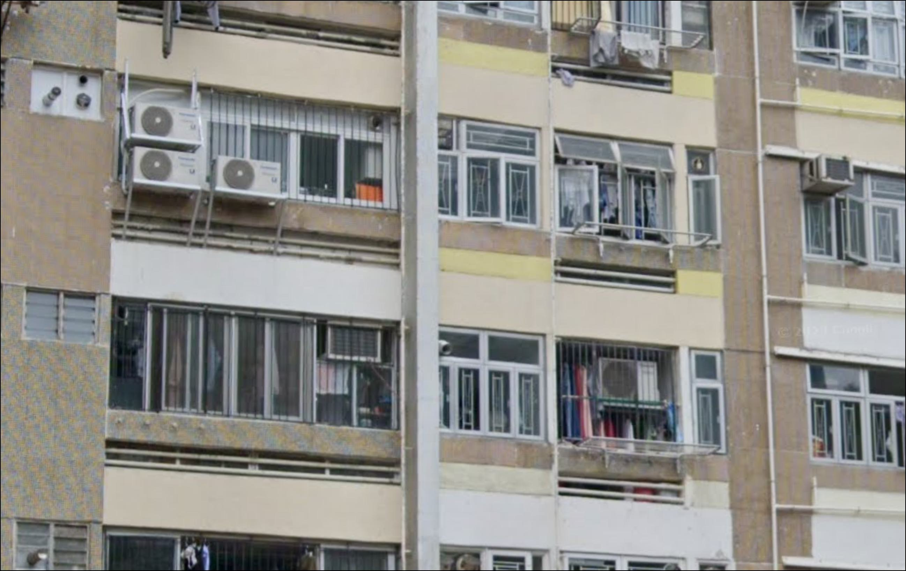
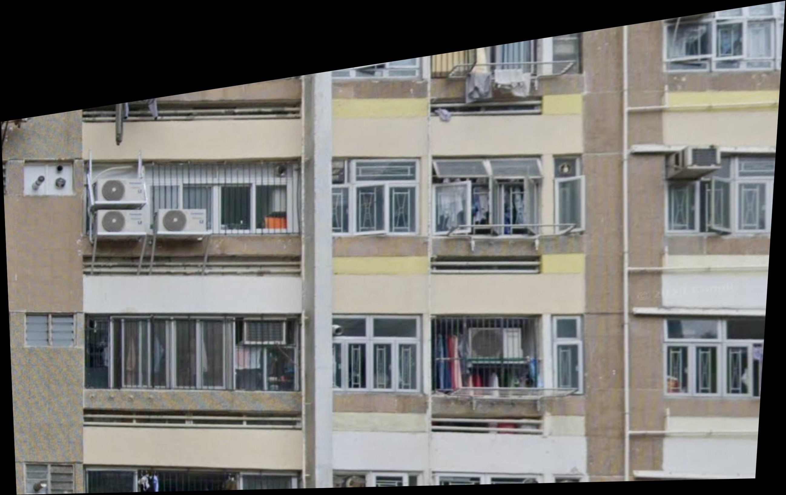

# Perspective Correction
This simple python script is used to correct the perspective of building images， it converts buildings taken from different angles into front view images. 

The script is based on the OpenCV library, which is a powerful tool for image processing.

## Usage
1. Clone the repository
2. Install the required packages
```bash
pip install -r requirements.txt
```
3. Run the script
- if default image is put into the ./input folder and the output image will be saved in the ./output folder
```bash
python perspective_correction.py
```
- if you want to specify the input and output image path
```bash
python perspective_correction.py -I <input_image_path> -O <output_image_path>
```
or
```bash
python perspective_correction.py --input <input_image_path> --output <output_image_path>
```

## Demo
The demo operation of the batch processing and each function in the script is shown in the [demo.ipynb](./demo.ipynb) file.
The following result are sample input and output images.
- Input Image

- Output Image


## Author
[Xu Haozhou](https://hzempire.github.io/)